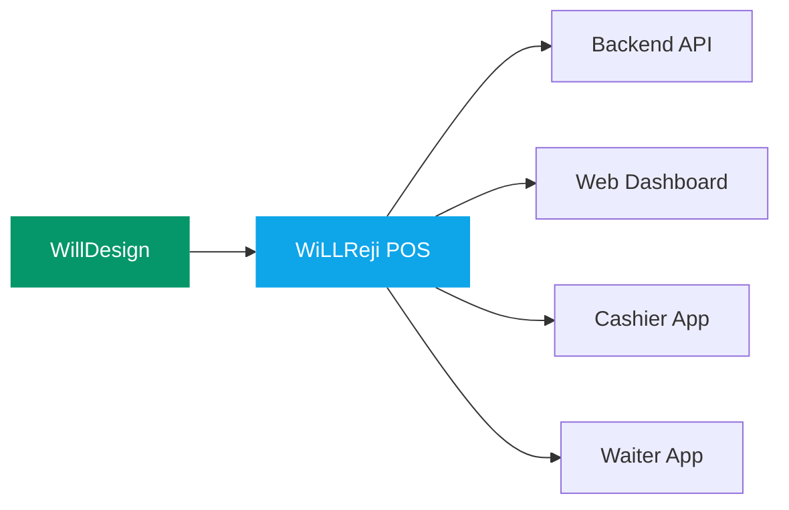

# WillDesign

### GOOD DESIGN · FLEXIBLE · REASONABLE

*Technology company building practical software for businesses*

---

## What We Build

**WiLLReji** — A modern point-of-sale system for restaurants and retail businesses. Multi-platform (web, cashier app, waiter app) with real-time order management, kitchen display, and business analytics.

## Tech Stack

## Our Ecosystem

## About Us

We deliver high-quality technical solutions with rapid delivery and dedicated post-launch support.

---

